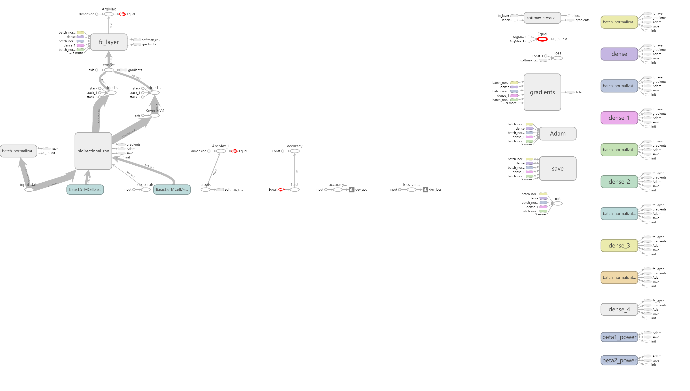
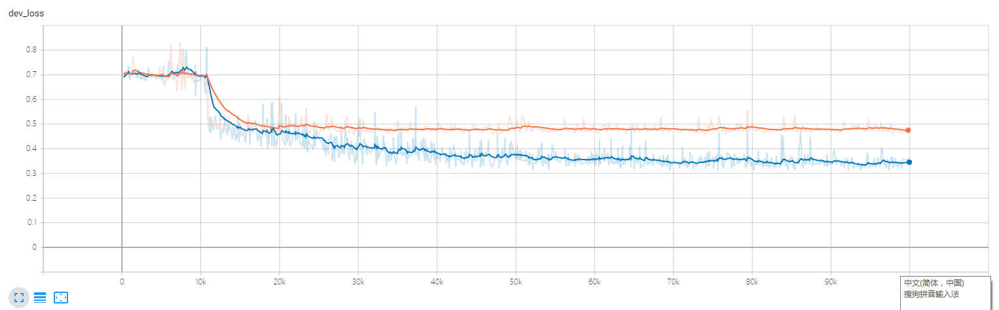
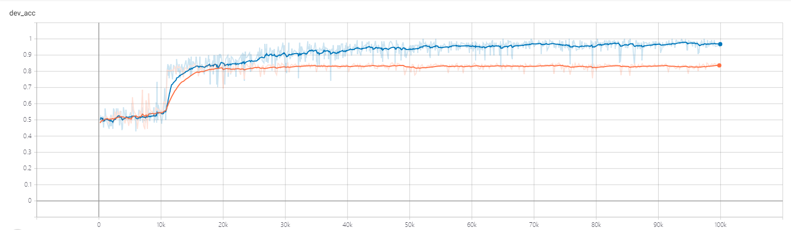

# COMP9444 assignment 2
## Recurrent Neural Networks and Sentiment Classification

### Introduction

we will develop a classifier able to detect the sentiment of movie reviews. Sentiment classification is an active area of research. Aside from improving performance of systems like Siri and Cortana, sentiment analysis is very actively utilized in the finance industry, where sentiment is required for automated trading on news snippits and press releases.


### Provided Files


`data.zip`: zip file containing the training, evaluation and test datasets.

`implementation.py`: This is a skeleton file for the learning model. this file contains the preprocessing and neural Network like RNN and fully-connect layers.

`runner.py`: This file is the framework of the project, which contain the data visualizing and training framework. The file is divided into 2 part. The first part is data loader which load the data and glove embedding from the data zip file and glove text file. After that, training step will be started. Finally, we test the accuracy with the test dataset.

`glove.6B.50d.zip`: This is a zip file containing the embedding vectors used in this project. Word embeddings have been shown to improve the performance of many NLP models by converting words from character arrays to vectors that contain semantic information of the word itself. In this project, we use GloVe embeddings, you can read more about them [*here*](https://nlp.stanford.edu/projects/glove/). **This file should be unzip first.**

### Dataset

The training dataset contains a series of movie reviews scraped from the IMDB website. There are no more than 30 reviews for any one specific movie. The "data" directory contains two sub-directories, "train" and "validate". Each of these contains two sub-directories, "pos" and "neg". These directories contain the raw reviews in plain text form. The "train" directory contains 12500 positive and 12500 negative reviews; the "validate" directory contains 1000 positive and 1000 negative reviews. Each review is confined to the first line of its associated text file, with no line breaks.

### Preprocessing

Here is the technique that we use in this project:
- Removing stop words
- Stripping/adding punctuation
- Changing case


### Model Structure



We preprocess the words though getting rid of stop words and then encode rest of words with GloVe so that the word vector dimention reduce to 50. In the second place, we sent those wordvec to the bidirection Recurrent Neural Network feature extractor. At last, the 5-fully connect layers used in the segmentation classification to improve the model accuracy up to 85%.

### Visualizing Progress

You can view the progress of your models using the tensorboard logging included in that file. To view these logs, run the following command from the source directory:

```shell
$tensorboard --logdir ./tensorboard
```

Open a Web browser and navigate to

    http://localhost:6006

### Results:

learning curve for validation loss (orange) and train loss (blue) showm at the Tensorboard:


learning curve for validation accuracy (orange) and train accuracy (blue) and validation accuracy should be about 85%:

